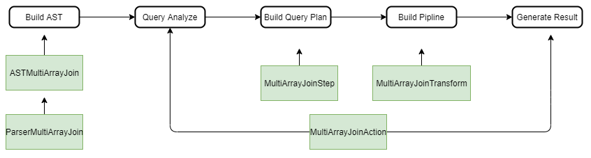
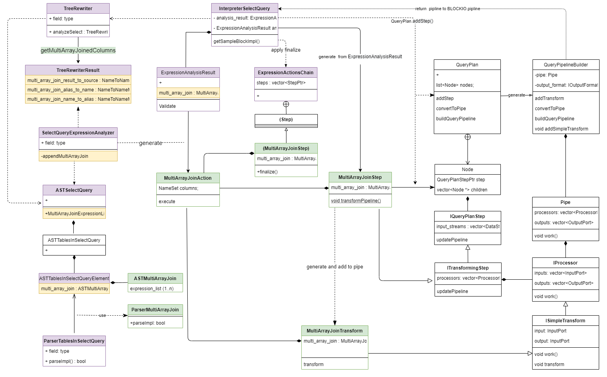
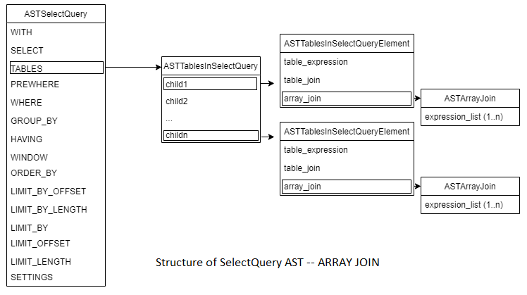
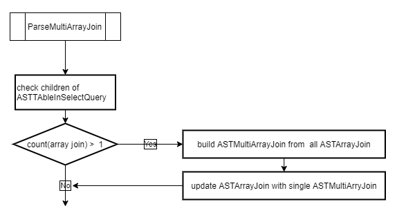
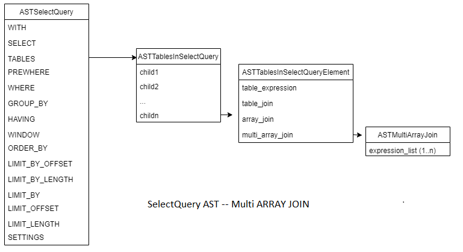
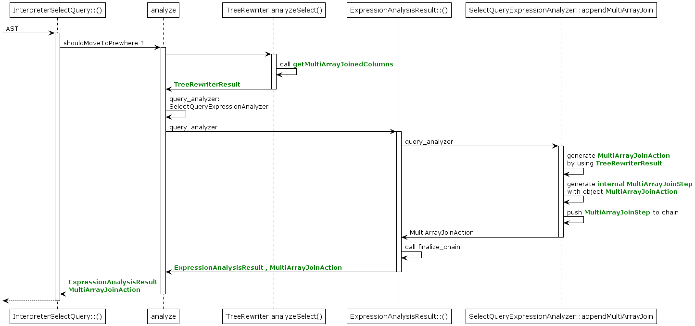

# Multiple ARRAY JOIN (Cartesian Product of Arrays) Design Doc
   

[Overview](#overview)    
[Problem](#problem)    
[Requirement](#goal)    
[Implementation](#implementation)    
&nbsp;&nbsp;&nbsp;&nbsp;&nbsp;&nbsp;[Description](#description)    
&nbsp;&nbsp;&nbsp;&nbsp;&nbsp;&nbsp;[Limit setting](#setting)    
&nbsp;&nbsp;&nbsp;&nbsp;&nbsp;&nbsp;[New objects needed for Multi Array Join](#objects)    
&nbsp;&nbsp;&nbsp;&nbsp;&nbsp;&nbsp;[Build AST of Multi Array Join](#ast)    
&nbsp;&nbsp;&nbsp;&nbsp;&nbsp;&nbsp;[Query Analyze, optimization](#optimization)     
&nbsp;&nbsp;&nbsp;&nbsp;&nbsp;&nbsp;[Build query plan, pipeline](#pipline)    
&nbsp;&nbsp;&nbsp;&nbsp;&nbsp;&nbsp;[Generate Result](#execution)    
[Test Plan](#test)    

# Overview<a name="overview"></a>
The Multiple ARRAY JOIN is a missed feature of ClickHouse as described in the Open Source issue [#8687](https://github.com/ClickHouse/ClickHouse/issues/8687). 
# Problem<a name="problem"></a>
Currently this feature only support one ARRAY JOIN, but can join multi arrays. In this case, JOIN is performed with them simultaneously (the direct sum, not the cartesian product).   

Described in this issue: [Describe how identifiers in SELECT queries are resolved #23194](https://github.com/ClickHouse/ClickHouse/issues/23194), some identifier resolving may affect the behaviour of the ARRAY JOIN.   


# Requirements<a name="goal"></a>
The requirements  are base on:
- Current behaviour of ARRAY JOIN   
- The description of the issue [#8687](https://github.com/ClickHouse/ClickHouse/issues/8687)   
- Currently does not consider the requiremets in [#23194](https://github.com/ClickHouse/ClickHouse/issues/23194) ( will apply later)     


New feature will not affect the behavior of existing ARRAY JOIN, e.g., one ARRAY JOIN with one column or one ARRAY JOIN with multiple column.
new feature will produce cartesian product of arrays (`arr1 x arr2`):
1. Support multiple INNER ARRAY JOIN with one column, each ARRAY JOIN only has one column. e.g.    
    ```
    ARRAY JOIN arr1 ARRAY JOIN  arr2
    ```
2. Support multiple LEFT ARRAY JOIN with one column, each ARRAY JOIN only has one column. e.g.   
    ```
    LEFT ARRAY JOIN arr1 LEFT ARRAY JOIN arr2
    ``` 
3. Support multiple ARRAY JOIN combined inner and left join with one column, each ARRAY JOIN only has one column. e.g.   
     ```
    ARRAY JOIN arr1 LEFT ARRAY JOIN arr2
    ```
4. Support multiple ARRAY JOIN with one column, and aliases. e.g.   
    ```
    ARRAY JOIN arr1 as c1 ARRAY JOIN arr2 as c2
    ```
5. Support multiple ARRAY JOIN with nested struct, e.g.   
    ```
    ARRAY JOIN nested1 ARRAY JOIN nested2
    ```   
6. Support multiple ARRAY JOIN with multiple column, e.g.  
    ```
    ARRAY JOIN arr1 ARRAY JOIN arr2, arr3`, will  result `arr1 x (arr2 + arr3)
    ```


# Implementation<a name="implementation"></a>

## Description<a name="description"></a>
**The basic idea is to follow the logic current ARRAY JOIN, use a different class or struct to implement the functionality. In this way, we can have minmum impacts on current behavior of ARRAY Join.**

ARRAY JOIN (Multi ARRAY JOIN) clause is a part select query, involved in the following stages of Select Query process:  
  
 
 So the implementation include:  
  - New objects needed for Multi Array Join
  - Build AST of Multi Array Join
  - Query Analyze
  - Build query plan, pipeline
  - Generate Result

 


## Limit setting<a name="setting"></a>
Because Cartesian Product of Arrays can produce huge data set, so it's necessary to use a configurable parameter in settings to limit the number of arrays. 
 - Define  `max_multiple_array_join`   
    add to the settings, will be used when building AST of Multi Array Join
 
## New objects needed for Multi Array Join<a name="objects"></a>

- AST of the Multi Array Join:    

    ```c++
    struct ASTMultiArrayJoin : public IAST
    {
        ASTPtr expression_list;
        ...
    };
    ```

- Parser to handle the multiple array join AST:  

    ```c++ 
    class ParserMultiArrayJoin : public IParserBase
    {
    protected:
        const char * getName() const override { return "multiple array join"; }
        bool parseImpl(Pos & pos, ASTPtr & node, Expected & expected) override;
    };
    ```
- Action object to Generate the Multi Array Join.
    ```c++
    class MultiArrayJoinAction
    {
    public:
        NameSet columns;
        ...
        void execute(Block & block);
    };
    ```
- Processor to Execute Multi ARRAY JOIN (using the Action object )
    ```c++
    class MultiArrayJoinTransform : public ISimpleTransform
    {
    public:
        ...
    protected:
        void transform(Chunk & chunk) override;
    private:
        MultiArrayJoinActionPtr multi_array_join;
    };
    ```
- QueryPlanStep object used to build Pipeline
    ```c++
    class MultiArrayJoinStep : public ITransformingStep
    {
    public:
        ...
        void transformPipeline(QueryPipelineBuilder & pipeline, const BuildQueryPipelineSettings & settings) override;
    private:
        MultiArrayJoinActionPtr multi_array_join;
        Block res_header;
    };
    ```

more detailed class diagram shows the relationship between the objects.   

   

Where the green ones are new classes or functions, the purple one are the class need to be modified.  

## Build AST of Multi Array Join<a name="ast"></a>

The ClickHosue currently build array join AST using the keyword `ARRAY JOIN` , it will create multiple array join AST if multiple keyword `ARRAY JOIN` exist in the select query. However it will raise an exception: `Support for more than one ARRAY JOIN in query is not implemented.`  during the query analysis for optimization.

To support more than one ARRAY JOIN in query, we will replace the multiple array join AST to a single `Multi ARRAY JOIN` AST.

- Current AST of Select Query    
     

    - AST of Select Query has child ASTs for each clause in the query, e.g.:    
       - AST of WITH
       - AST of SELECT
       - AST of TABLEs
       - ...
    - AST of TABLEs has multiple child AST of table element
    - Each AST of table element can have one of the following type AST:
       - table_expression
       - table_join 
       - array_join
  
 - Rebuild `Muti Array Join` from multiple `Array Join` 

    class `ParserTablesInSelectQuery` is used to parse tables elements, will add    `ParserMultiArrayJoin().parse()`  before return to apply multiple array join:

    ```c++
    bool ParserTablesInSelectQuery::parseImpl(Pos & pos, ASTPtr & node, Expected & expected)
    {
        ....
    
        ParserMultiArrayJoin().parse(...);    //<-- add new parser 
        return true;
    }
    ```
    `ParserMultiArrayJoin` will check the children of ASTTablesInSelectQuery, if there's only   one array join, then will do nothing, otherwise will update the ASTArrayJoin with     ASTMultiArrayJoin.

       


    and a new AST pointer for multi array join is added to ASTTablesInSelectQueryElement for the next step.

    ```c++
    struct ASTTablesInSelectQueryElement : public IAST
    {
        ASTPtr table_join;        
        ASTPtr table_expression;  
        ASTPtr array_join;        
        ASTPtr multi_array_join;      // <- new membert
    
    };

    ```
 - AST of Select Query after rebuilt
After ParserMultiArrayJoin, the Select Query AST looks like (if there are multiple array joins):  
      

## Query Analyze<a name="optimization"></a> 
After AST built, ClickHouse will do the query analysis and optimization, can create a processor and class `InterpreterSelectQuery` is responsible to do this.
- Class TreeRewriter    
    rewrite AST, use method analyzeSelect to analyze and rewrite select query and call a global function `getMultiArrayJoinedCoumns` get columns of ArrayJoinedColumns and stored in `TreeRewriterResult`;
    ```c++
    TreeRewriterResultPtr TreeRewriter::analyzeSelect(..) 
    {
        ...
        getMultiArrayJoinedColumns(...);
        ...
    }
    ```
- Struct TreeRewriterResult, add columns info for Multi ARRAY JOIN: 
    ```c++
    struct TreeRewriterResult 
    {
        NameToNameMap multi_array_join_result_to_source;
        NameToNameMap multi_array_join_alias_to_name;
        NameToNameMap multi_array_join_name_to_alias;
    }
    ```

- Class ASTSelectQuery    
    add method MultiArrayJoinExpressionList() to get the MultiArrayJoin
    ```c++
    class ASTSelectQuery : public IAST
    {
        ...
        std::pair<ASTPtr, bool> MultiArrayJoinExpressionList() const;
        ...
    }
    ```

- Function getMultiArrayJoinedColumns   
    ```c++
     use ArrayJoinedColumnsVisitor to fill multi_array_join_result_to_source    

     get AST of multi array join by using ASTSelectQuery::MultiArrayJoinExpressionList    

     Get Columns name   

     Handle array or nested table   
    ```


- Class SelectQueryExpressionAnalyzer    
  add a method to generate Multi ARRAY JOIN executor  
    ```c++
    class SelectQueryExpressionAnalyzer
    {
        ...
        MultiArrayJoinActionPtr appendMultiArrayJoin(ExpressionActionsChain & chain, ...);
        ...
    }
    ```

- Struct ExpressionAnalysisResult
    ```c++
    ExpressionAnalysisResult::ExpressionAnalysisResult(...)
    {
        ...
        mult_iarray_join = SelectQueryExpressionAnalyzer::instance().appendMultiArrayJoin(chain, ....);
        ...
    }
    ```
- Class MultiArrayJoinStep inside ExpressionActionsChain
    ```c++
    struct ExpressionActionsChain : WithContext
    {

        ...
        struct MultiArrayJoinStep : public Step
        {   
            ...
            MultiArrayJoinActionPtr array_join;

            void finalize(const NameSet & required_output_) override;
            ...
        };        
        ...
    }

    ```
- Analysis sequence   
    the above class and functions will be working in the sequence  as the following diagram:   
      

## Build query plan, pipeline<a name="pipline"></a>
  Now, we have the ExpressionAnalysisResult and MultiArrayJoinAction objet.
- Create Multi Array Join Step and add to query plan
    ```c++
    void InterpreterSelectQuery::executeImpl(QueryPlan & query_plan ...)
    {
        ...
        if ExpressionAnalysisResult has multi_array_join then :
         generate object of MultiArrayJoinStep
         Add to query plan by query_plan.addStep
        ...
    }
    ```
- Build pipeline
    ```c++
    void MultiArrayJoinStep::transformPipeline(QueryPipelineBuilder & pipeline, ...)
    {
        generate MultiArrayJoinTransform object;

        Add to pipeline by pipeline.addSimpleTransform
    }
    ```

## Generate Result<a name="execution"></a>
After MultiArrayJoinTransform object and added to pipeline, when the pipeline is executed, `MultiArrayJoinTransform::transform` will be called

- Transform called by pipeline    
    The virtual method `work()` of `IProcessor` is called, and finally it will call the method 'transform' of created instance of subclass.
    ```c++
    void MultiArrayJoinTransform::transform (Chunk & chunk)
    {
        Get Block from the chunk
        Excute the MultiArrayJoinAction
        update the chunk
    }
    ```
- Generate Result  
    The result of multiple array join will be performed by `MultiArrayJoinAction::`
    ```c++
    void MultiArrayJoinAction::execute(Block & block) 
    {
        Process unaligned column if required
        Process Left Join if required
        for every column in the block:
            if contained in the column list of array join then:
                do cartesian product join
        update the block
    }
    ```
# Test Plan<a name="test"></a>
Please check this document:   
[Multiple ARRAY JOIN Test Plan](Multi_Array_Join_Test_Cases.md)