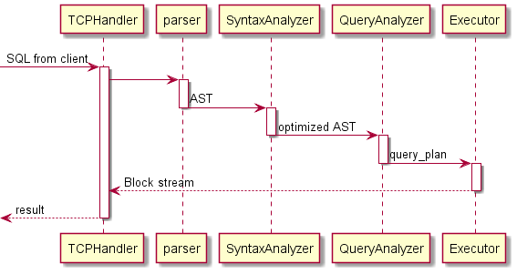
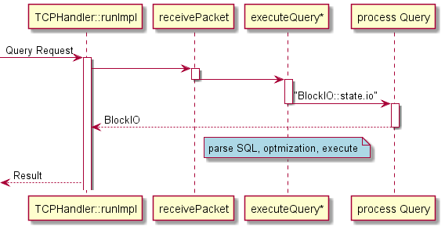
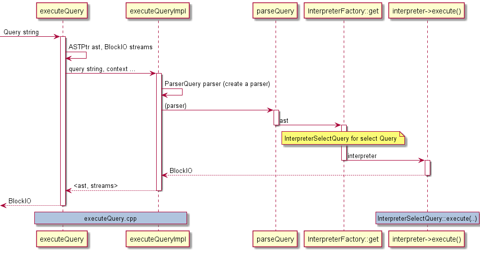
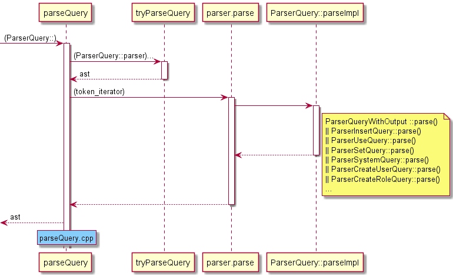
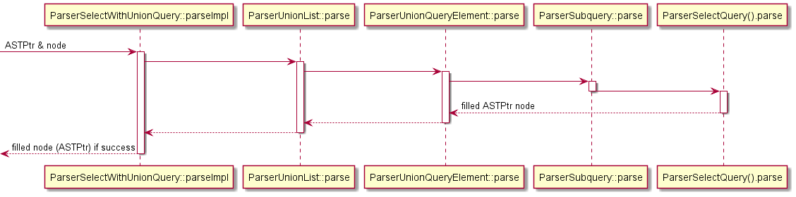
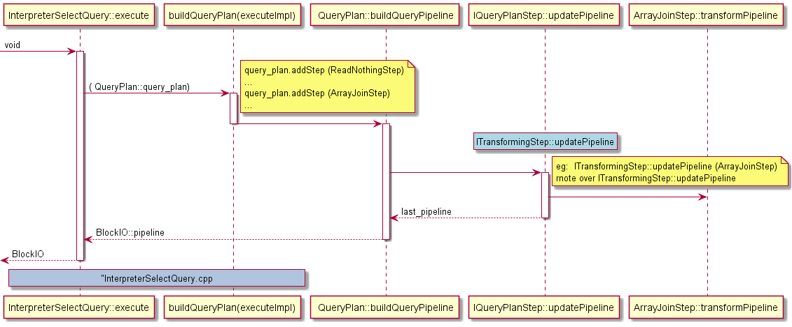
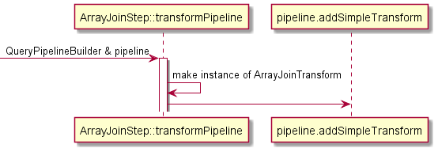

# High level view of SQL query process 
use the TCP as an example.
1. The server receives the SQL request sent by the client. The protocol layer of the server will unpack and parse the SQL.

2. Server is responsible for initializing the context and Network Handler, and then Parser performs lexical and grammatical analysis on Query and parses it into AST

3. Interpreter's SyntaxAnalyzer will apply some heuristic rules to optimize and rewrite the AST

4. The ExpressionAnalyzer of the Interpreter generates an execution plan based on the context information and the optimized  AST

5. The execution plan is distributed to local or distributed executors, each obtains data from the storage engine, and applies the execution plan

6. The Server outputs the result after execution to the Socket buffer in the form of a block stream, and the Client reads the result from the Socket to get the result



# TCPHandler

the main functionality is implemented in **TCPHandler::runImpl**

```
void TCPHandler::runImpl()
{
    //create input , output buffer
    in = std::make_shared<ReadBufferFromPocoSocket>(socket());
    out = std::make_shared<WriteBufferFromPocoSocket>(socket());
    
    while (true){
        receivePacket();
        ...
        state.io = executeQuery(state.query, *query_context, false, state.stage, may_have_embedded_data);

        //process different Query according to Query type

        processInsertQuery();
        
        processOrdinaryQueryWithProcessors();
         ...
    }
}
```
which do the following:
* Initialize buffers for input and output streams
* Accept request message, unpack
* Execute Query (including analysis, Query rewrite, plan generation and result generation)
* Save the result to the output stream, then send it to the Socket's buffer, send back to the client


# The execution path of SQL Query
## executeQuery
the SQL logic started from the [ExecuteQuery](https://clickhouse.com/codebrowser/html_report/ClickHouse/src/Interpreters/executeQuery.cpp.html#973), and implemented in the function **executeQueryImpl**

look at the main logic:

```
static std::tuple<ASTPtr, BlockIO> executeQueryImpl()
{
    //Parser
    ParserQuery parser(end, settings.enable_debug_queries);
    ASTPtr ast;
 
    //parse Query to AST
    ast = parseQuery(parser, begin, end, "", max_query_size);
 
    //get interpreter instance from AST ( for select will get a interpreter for select)
    auto interpreter = InterpreterFactory::get(ast, context, stage);
 
    // interprete AST, result is  BlockIO
    res = interpreter->execute();
    
    return std::make_tuple(ast, res);
}
```
* Build Parser, parse Query into AST (Abstract Syntax Tree)
* InterpreterFactory generates corresponding Interpreter instances according to AST
* AST is parsed by Interpreter, and the execution result is a BlockIO. BlockIO is a package of BlockInputStream and BlockOutputStream.


### Parser
class ParserQuery : public IParserBase : public IParser

### ParseQuery  
 crate an ParserQuery instance, call tryParseQuery to get AST, then finally call ParserQuery::parseImpl() 
```
bool ParserQuery::parseImpl(Pos & pos, ASTPtr & node, Expected & expected)
{
    ParserQueryWithOutput query_with_output_p(end);
    ParserInsertQuery insert_p(end);
    ParserUseQuery use_p;
    ParserSetQuery set_p;
    ParserSystemQuery system_p;
    ParserCreateUserQuery create_user_p;
    ParserCreateRoleQuery create_role_p;
    ParserCreateQuotaQuery create_quota_p;
    ParserCreateRowPolicyQuery create_row_policy_p;
    ParserCreateSettingsProfileQuery create_settings_profile_p;
    ParserCreateFunctionQuery create_function_p;
    ParserDropFunctionQuery drop_function_p;
    ParserDropAccessEntityQuery drop_access_entity_p;
    ParserGrantQuery grant_p;
    ParserSetRoleQuery set_role_p;
    ParserExternalDDLQuery external_ddl_p;
    ParserBackupQuery backup_p;
    bool res = query_with_output_p.parse(pos, node, expected)
        || insert_p.parse(pos, node, expected)
        || use_p.parse(pos, node, expected)
        || set_role_p.parse(pos, node, expected)
        || set_p.parse(pos, node, expected)
        || system_p.parse(pos, node, expected)
        || create_user_p.parse(pos, node, expected)
        || create_role_p.parse(pos, node, expected)
        || create_quota_p.parse(pos, node, expected)
        || create_row_policy_p.parse(pos, node, expected)
        || create_settings_profile_p.parse(pos, node, expected)
        || create_function_p.parse(pos, node, expected)
        || drop_function_p.parse(pos, node, expected)
        || drop_access_entity_p.parse(pos, node, expected)
        || grant_p.parse(pos, node, expected)
        || external_ddl_p.parse(pos, node, expected)
        || backup_p.parse(pos, node, expected);
    return res;
}
```
The above code shows the type Query that ClickHouse support, can be parsed with a ParserQuery instance.
 

 

the Select Query is parsed by the:
### ParserQueryWithOutput

it will call parseImpl:
```
bool ParserQueryWithOutput::parseImpl(Pos & pos, ASTPtr & node, Expected & expected)
{
    ParserShowTablesQuery show_tables_p;
    ParserSelectWithUnionQuery select_p;
    ParserTablePropertiesQuery table_p;
    ParserDescribeTableQuery describe_table_p;
    ParserShowProcesslistQuery show_processlist_p;
    ParserCreateQuery create_p;
    ParserAlterQuery alter_p;
    ParserRenameQuery rename_p;
    ParserDropQuery drop_p;
    ParserCheckQuery check_p;
    ParserOptimizeQuery optimize_p;
    ParserKillQueryQuery kill_query_p;
    ParserWatchQuery watch_p;
    ParserShowAccessQuery show_access_p;
    ParserShowAccessEntitiesQuery show_access_entities_p;
    ParserShowCreateAccessEntityQuery show_create_access_entity_p;
    ParserShowGrantsQuery show_grants_p;
    ParserShowPrivilegesQuery show_privileges_p;
    ParserExplainQuery explain_p(end);
    ASTPtr query;
    bool parsed =
           explain_p.parse(pos, query, expected)
        || select_p.parse(pos, query, expected)
        || show_create_access_entity_p.parse(pos, query, expected) /// should be before `show_tables_p`
        || show_tables_p.parse(pos, query, expected)
        || table_p.parse(pos, query, expected)
        || describe_table_p.parse(pos, query, expected)
        || show_processlist_p.parse(pos, query, expected)
        || create_p.parse(pos, query, expected)
        || alter_p.parse(pos, query, expected)
        || rename_p.parse(pos, query, expected)
        || drop_p.parse(pos, query, expected)
        || check_p.parse(pos, query, expected)
        || kill_query_p.parse(pos, query, expected)
        || optimize_p.parse(pos, query, expected)
        || watch_p.parse(pos, query, expected)
        || show_access_p.parse(pos, query, expected)
        || show_access_entities_p.parse(pos, query, expected)
        || show_grants_p.parse(pos, query, expected)
        || show_privileges_p.parse(pos, query, expected);
...
```

A SELECT statement has two different representations, single-select and multi-select. That is, when the UNION ALL keyword exists, the SELECT statement is multi-select, otherwise it is single.
The existence of UNION ALL means that this SQL statement can be parsed into multiple single QUERY statements that can be executed independently. Therefore, the ParserList object is used to save possible parallel statements:


ParserSelectQuery::parse is implemented:
```
bool ParserSelectQuery::parseImpl(Pos & pos, ASTPtr & node, Expected & expected)
{
    auto select_query = std::make_shared<ASTSelectQuery>();
    node = select_query;
    ParserKeyword s_select("SELECT");
    ParserKeyword s_all("ALL");
    ParserKeyword s_distinct("DISTINCT");
    ParserKeyword s_distinct_on("DISTINCT ON");
    ParserKeyword s_from("FROM");
    ParserKeyword s_prewhere("PREWHERE");
    ParserKeyword s_where("WHERE");
    ParserKeyword s_group_by("GROUP BY");
    ParserKeyword s_with("WITH");
    ParserKeyword s_totals("TOTALS");
    ParserKeyword s_having("HAVING");
    ParserKeyword s_window("WINDOW");
    ParserKeyword s_order_by("ORDER BY");
    ParserKeyword s_limit("LIMIT");
    ParserKeyword s_settings("SETTINGS");
    ParserKeyword s_by("BY");
    ParserKeyword s_rollup("ROLLUP");
    ParserKeyword s_cube("CUBE");
    ParserKeyword s_grouping_sets("GROUPING SETS");
    ParserKeyword s_top("TOP");
    ParserKeyword s_with_ties("WITH TIES");
    ParserKeyword s_offset("OFFSET");
    ParserKeyword s_fetch("FETCH");
    ParserKeyword s_only("ONLY");
    ParserKeyword s_row("ROW");
    ParserKeyword s_rows("ROWS");
    ParserKeyword s_first("FIRST");
    ParserKeyword s_next("NEXT");
...

```
check source:
[ParserSelectWithUnionQuery::parseImpl](https://clickhouse.com/codebrowser/html_report/ClickHouse/src/Parsers/ParserSelectWithUnionQuery.cpp.html#9)
 -> [ParserUnionList::parse](https://clickhouse.com/codebrowser/html_report/ClickHouse/src/Parsers/ParserSelectWithUnionQuery.cpp.html#15)
 -> [ParserUnionQueryElement::parse](https://clickhouse.com/codebrowser/html_report/ClickHouse/src/Parsers/ExpressionListParsers.cpp.html#133)
 -> [ParserSubquery().parse](https://clickhouse.com/codebrowser/html_report/ClickHouse/src/Parsers/ParserUnionQueryElement.cpp.html#13)
 -> [ParserSelectQuery().parse](https://clickhouse.com/codebrowser/html_report/ClickHouse/src/Parsers/ParserUnionQueryElement.cpp.html#13)


## Interpret process of Select Query statement
### InterpreterSelectQuery::execute(..)
in the procedure of executeQueryImpl(...) (executeQuery.cpp), the InterpreterFactory::get(...) method will return an instance of the InterpreterSelectQuery class. At the same time, when this class is created, it will traverse the entire AST tree to complete the tree check and basic optimization and adjustment work, such as syntax exceptions, expressions Errors, etc. For more specific processes.
After the creation of the InterpreterSelectQuery object is completed, the execute() method is called: 
```
BlockIO InterpreterSelectQuery::execute()
{
    BlockIO res;
    QueryPlan query_plan;
    buildQueryPlan(query_plan);
    res.pipeline = QueryPipelineBuilder::getPipeline(std::move(*query_plan.buildQueryPipeline(
        QueryPlanOptimizationSettings::fromContext(context), BuildQueryPipelineSettings::fromContext(context))));
    return res;
}

```



### buildQueryPlan:


ArrayJoinStep::transformPipeline



ArrayJoinTransform has aArrayJoinAction member,  finially will call 
[ArrayJoinAction::Execute](https://clickhouse.com/codebrowser/html_report/ClickHouse/src/Interpreters/ArrayJoinAction.cpp.html#54)
