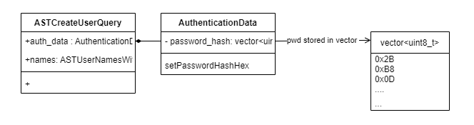
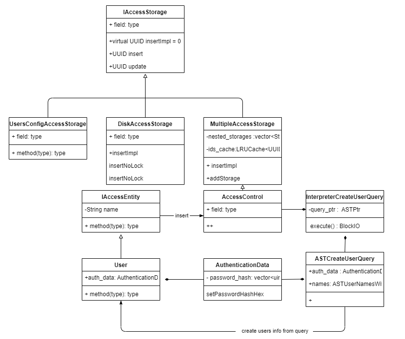

# How the entity of Create User saved.
suppose we want to create a user by:      
```sql
CREATE USER IF NOT EXISTS user1 IDENTIFIED WITH SHA256_PASSWORD BY 'secret';
```

let's take a look how the ClickHouse process it      

## Parse Query and Create AST   
first step is to parse query and generate an AST of Create User `ASTCreateUserQuery`
the AST has a memeber of `AuthenticationData` (auth_data)  which holds the password, after the AST created, all crendentials also created as show bellow:

  

## Execute Query

`InterpreterCreateUserQuery::execute()` is used to process Query, Here is a snippet of the code:

```c++
BlockIO InterpreterCreateUserQuery::execute()
{
    //<------ 1 
    const auto & query = query_ptr->as<const ASTCreateUserQuery &>();
    auto & access_control = getContext()->getAccessControl();
    ...
    if (query.alter)
    {
        ...
    }
    else
    {
        // <-------2
        std::vector<AccessEntityPtr> new_users;
        for (const auto & name : *query.names)
        {
            auto new_user = std::make_shared<User>();
            updateUserFromQueryImpl(*new_user, query, name, default_roles_from_query, settings_from_query, RolesOrUsersSet::AllTag{});
            new_users.emplace_back(std::move(new_user));
        }

        std::vector<UUID> ids;
        
        if (query.if_not_exists)
            ids = access_control.tryInsert(new_users); //  <------3 
        else if (query.or_replace)
            ids = access_control.insertOrReplace(new_users);
        else
            ids = access_control.insert(new_users);
        ....
    }

    return {};
}
```

the related process:
1. Gget the AST (`query`)  and Access control (`access_control`).   
    the `query` contans the parsed info query   
    the `access_control` is used to access storerage   
2. This step create users with parameters from the query, include auth_data. the Users are hold in an vector.   
3. access_control will insert the vector into a Storage object.


access_control.tryInsert(new_users)  will call `MultipleAccessStorage::insertImpl`

class MultipleAccessStorage has a memeber `vector<StoragePtr> nested_storages` which holds DiskAccessStorage objects who are responsible to write to files

```c++
UUID MultipleAccessStorage::insertImpl(const AccessEntityPtr & entity, bool replace_if_exists)
{
    
    auto storages = getStoragesInternal();  //  <-------1

    std::shared_ptr<IAccessStorage> storage_for_insertion;
    for (const auto & storage : *storages)
    {
        if (storage->canInsert(entity) ||
            storage->find(entity->getType(), entity->getName()))
        {
            storage_for_insertion = storage;  // <-----------2
            break;
        }
    }

    if (!storage_for_insertion)
        throw Exception("Not found a storage to insert " + entity->formatTypeWithName(), ErrorCodes::ACCESS_STORAGE_FOR_INSERTION_NOT_FOUND);

    auto id = replace_if_exists ? storage_for_insertion->insertOrReplace(entity) : storage_for_insertion->insert(entity);  // <------------ 3 
    std::lock_guard lock{mutex};
    ids_cache.set(id, storage_for_insertion);  // <------------ 4
    return id;
}
```

 when `MultipleAccessStorage::insertImpl` is called, the parameter `AccessEntityPtr & entity` is passed by a User wich is a sub class of `IAccessEntity`.  
1. Get all availbe `DiskAccessStorage` objects.   
2. Find the object which can do insert;
3. Do insertion by object storage_for_insertion;
4. Add the storage obecjt to its cach.

storage_for_insertion->insert(entity) will call `DiskAccessStorage::insertImpl`:    

```c++
UUID DiskAccessStorage::insertImpl(const AccessEntityPtr & new_entity, bool replace_if_exists)
{
    Notifications notifications;
    SCOPE_EXIT({ notify(notifications); });

    UUID id = generateRandomID();
    std::lock_guard lock{mutex};
    insertNoLock(id, new_entity, replace_if_exists, notifications);  // <---
    return id;
}

```

Let's see what `insertNoLock` do:   

```c++
void DiskAccessStorage::insertNoLock(const UUID & id, const AccessEntityPtr & new_entity, bool replace_if_exists, Notifications & notifications)
{
   ...
    writeAccessEntityToDisk(id, *new_entity);
    ...
}


void DiskAccessStorage::writeAccessEntityToDisk(const UUID & id, const IAccessEntity & entity) const
{
    writeEntityFile(getEntityFilePath(directory_path, id), entity);
}


void writeEntityFile(const String & file_path, const IAccessEntity & entity)
{
    String file_contents = serializeAccessEntity(entity);
    ...
    /// Write the file.
    ...
}

```
Finaly the entity is serialized and wroten to disk.   

Let's go back to `MultipleAccessStorage::insertImpl`
```c++
UUID MultipleAccessStorage::insertImpl(const AccessEntityPtr & entity, bool replace_if_exists)
{
    
    auto storages = getStoragesInternal();  //  <-------1
    ...
}
```

it was mentioned storages are `DiskAccessStorage` objects.

the `getStoragesInternal()` returns  the member `nested_storages`, now let's see what is inside the `nested_storages`.

When ClickHose serever start, call `access_control.addStoragesFromMainConfig` : 

```c++
int Server::main(const std::vector<std::string> & /*args*/)
{ ...
    auto & access_control = global_context->getAccessControl();
    if (config().has("custom_settings_prefixes"))
        access_control.setCustomSettingsPrefixes(config().getString("custom_settings_prefixes"));

    /// Initialize access storages.
    try
    {
        access_control.addStoragesFromMainConfig(config(), config_path, [&] { return global_context->getZooKeeper(); });
    }
    catch (...)
    {
        tryLogCurrentException(log);
        throw;
    }
  ...
}
```
`access_control.addStoragesFromMainConfig` will call `AccessControl::addDiskStorage`

```c++
void AccessControl::addStoragesFromMainConfig(..)
{
    ...  
    String disk_storage_dir = config.getString("access_control_path", "");
    if (!disk_storage_dir.empty())
        addDiskStorage(disk_storage_dir);
    ...
}
```
'AccessControl::addDiskStorage'

```c++
void AccessControl::addDiskStorage(const String & storage_name_, const String & directory_, bool readonly_)
{
    ...

    auto new_storage = std::make_shared<DiskAccessStorage>( , directory_, readonly_);
    addStorage(new_storage);
    ...
}


void MultipleAccessStorage::addStorage(const StoragePtr & new_storage)
{
    std::unique_lock lock{mutex};
    if (boost::range::find(*nested_storages, new_storage) != nested_storages->end())
        return;
    auto new_storages = std::make_shared<Storages>(*nested_storages);
    new_storages->push_back(new_storage);
    nested_storages = new_storages;
    updateSubscriptionsToNestedStorages(lock);
}
```

 `MultipleAccessStorage::addStorage` add the `DiskAccessStorage` to the `nested_storages`.


## Class Diagram   
the following class diagram can help to under stand the process:
 
