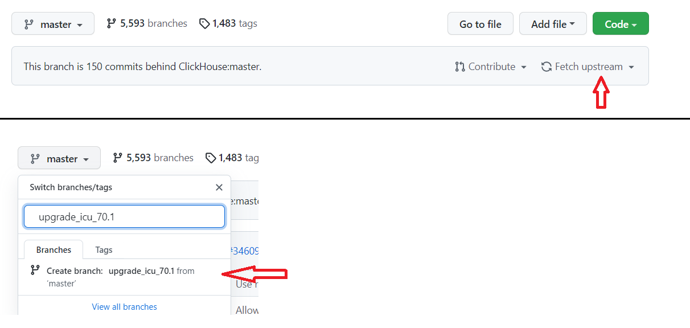
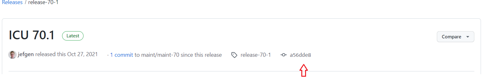

# Upgrade ClickHouse Submodule (upgrade icu practice)

##  Background

The are Vulnerabilities in some submodules, and the submodules need to upgrade to latest version. Here is the info about the submodule

|ClickHouse effected?	|Vulnerability ID	|Library|	Source File	|Severity| upgrade to |  
|----|----|----|----|----|----|
|yes, upgrade icu to latest|	WS-2019-0513|	icu-release-67-1	|ustring.cpp|	HIGH|icu-release-70-1	
|yes, upgrade icu to latest	|CVE-2020-10531|	icu-release-67-1	|unistr.cpp	|HIGH|icu-release-70-1	


## Upgrade Steps
1. synchronize forked repository and create a branch :
      

2. Pull the repo and update submodules on master:

    ```
    ~/src/ClickHouse# git checkout master

    ~/src/ClickHouse# git pull

    ~/src/ClickHouse# git submodule update
    ```
3. Go to the submodule, check current submodule:
    ```
    ~/src/ClickHouse# cd contrib/icu
    ~/src/ClickHouse/contrib/icu# git status
    ```
    The result shows the current version used match the submodule (icu @ faa2f9f).
    ```
    HEAD detached at faa2f9f9e1
    nothing to commit, working tree clean
    ```
4. Go to the branch created:
    ```
    ~/src/ClickHouse/contrib/icu# cd ../../
    ~/src/ClickHouse# 

    ~/src/ClickHouse# git checkout upgrade_icu_70.1
    ```
5. Find the hash code of the latest version of the submodule:

     

6. Setup the Submodule to the latest version :
    ```
    ~/src/ClickHouse# cd contrib/icu

    ~/src/ClickHouse/contrib/icu# git checkout a56dde8
    ```
    New version is picked up:
    ```
    Updating files: 100% (8367/8367), done.
    Previous HEAD position was faa2f9f9e1 ICU-20303 Break Iterator, improve handling of look-ahead rules.
    HEAD is now at a56dde820d ICU-21579 Fix warnings in number formatting code
    ```
    Check log:
    ```
    ~/src/ClickHouse/contrib/icu# git log
    ```

    The log shows the version of release-70-1:
    ```
    commit a56dde820dc35665a66f2e9ee8ba58e75049b668 (HEAD, tag: release-70-1)
    Author: Shane F. Carr <shane@unicode.org>
    Date:   Wed Oct 27 15:02:46 2021 -0700

    ICU-21579 Fix warnings in number formatting code

    ...
    ```
7. Find new files added and removed in new version:   
    ```
    git diff --name-status faa2f9f a56dde8 | grep ^A
    ```
    We only care about the c++ version, the new files are:
    ```
    icu4c/source/common/emojiprops.cpp
    icu4c/source/common/lstmbe.cpp
    icu4c/source/i18n/measunit_extra.cpp
    icu4c/source/i18n/number_symbolswrapper.cpp
    icu4c/source/i18n/number_usageprefs.cpp
    icu4c/source/i18n/numrange_capi.cpp
    icu4c/source/i18n/pluralranges.cpp
    icu4c/source/i18n/units_complexconverter.cpp
    icu4c/source/i18n/units_converter.cpp
    icu4c/source/i18n/units_data.cpp
    icu4c/source/i18n/units_router.cpp    
    ```
    run cmake tells you the files removed:
    ```
    /i18n/nounit.cpp
    ```
8. Make changes to the `contrib/icu-cmake/CMakeLists.txt`   
    Add the following to the setting of `ICUUC_SOURCES`   
    ```
    "${ICU_SOURCE_DIR}/common/emojiprops.cpp"
    "${ICU_SOURCE_DIR}/common/lstmbe.cpp"
    ```
    Add the following to the setting of `ICUI18N_SOURCES`
    ```
    "${ICU_SOURCE_DIR}/i18n/measunit_extra.cpp"
    "${ICU_SOURCE_DIR}/i18n/number_symbolswrapper.cpp"
    "${ICU_SOURCE_DIR}/i18n/number_usageprefs.cpp"
    "${ICU_SOURCE_DIR}/i18n/numrange_capi.cpp"
    "${ICU_SOURCE_DIR}/i18n/pluralranges.cpp"
    "${ICU_SOURCE_DIR}/i18n/units_complexconverter.cpp"
    "${ICU_SOURCE_DIR}/i18n/units_converter.cpp"
    "${ICU_SOURCE_DIR}/i18n/units_data.cpp"
    "${ICU_SOURCE_DIR}/i18n/units_router.cpp"    
    ```
    Delete the removed files:
    ```
    #"${ICU_SOURCE_DIR}/i18n/nounit.cpp"
    ```
    update ICUDATA_SOURCES :  
    change `"${ICUDATA_SOURCE_DIR}/icudt66l_dat.S"`  to  `"${ICUDATA_SOURCE_DIR}/icudt70l_dat.S"`   
    
9. Update the submodule icudata    
   icudata is in another repo `ClickHouse-Extras/icudata`


    - Generate the icudata for new version:  

        Clone the icu repo
        ```
         ~/src# git clone  --recursive git@github.com:unicode-org/icu.git
        ```
        In `icu4c/source` directory run `./configure` and `make`. The resulting file will be located at `./data/out/tmp/icudt70l_dat.S`
        ```
        ~/src# cd ./icu/icu4c/source
        ~/src/icu/icu4c/source# ./configure
        ~/src/icu/icu4c/source# make 
        ```
    
    - Update the contents of icudate     

        goto the repo of `ClickHouse-Extras/icudata`:  https://github.com/ClickHouse-Extras/icudata

        Fork the repo and create a branch : `upgrade_icu_70.1 `

        Clone repo:
        ```
        git clone git@github.com:kashwy/icudata.git
        ```
        Got the branch `upgrade_icu_70.1 `
        ```
        ~/src# cd icudata
        ~/src/icudata# git checkout upgrade_icu_70.1
        ```
        Copy the data file `icudt70l_dat.S` generated in above step and add to stage:
        ```
        ~/src/icudata# cp ../icu/icu4c/source/data/out/tmp/icudt70l_dat.S ./
        ~/src/icudata# git rm icudt66l_dat.S
        ~/src/icudata# git add icudt70l_dat.S
        ```
        update the README.md, change `icudt66l_dat.S` to  `icudt70l_dat.S`
        check the staged status:  
        ```   
        root@squibber1:~/src/icudata# git status
        On branch upgrade_icu_70.1
        Your branch is up to date with 'origin/upgrade_icu_70.1'.
        Changes to be committed:
        (use "git restore --staged <file>..." to unstage)
            modified:   README.md
            renamed:    icudt66l_dat.S -> icudt70l_dat.S    
        ```
    - Commit and Create PR  
        Commit:
        ```
        ~/src/icudata# git commit
        ```
        Add Commit Message:
        ```
        Upgrade icu to icu-release-70-1 

        upgrade due to vulnerabilities of WS-2019-0513 and CVE-2020-10531        
        ```
        Push and create PR:
        ```
        ~/src/icudata# git push
        ```

        PR Created: `https://github.com/ClickHouse-Extras/icudata/pull/1`   

    - update the submodule  icudate to the new commit:
        After the PR merged, find the commit code: `72d9a4a`
        check out to the new commit:
        ```
        ~/src/icudata# cd ~/src/ClickHouse
        ~/src/ClickHouse# cd contrib/icudata

        ~/src/ClickHouse/contrib/icudata# git checkout 72d9a4a
        ```

10. Update the reference of the icu in project:
    open `docs/en/development/contrib.md`
    update the reference of icu and icudata:  
    ```
    | icu | [Public Domain](https://github.com/unicode-org/icu/blob/a56dde820dc35665a66f2e9ee8ba58e75049b668/icu4c/LICENSE) |   

    | icudata | [Public Domain](https://github.com/ClickHouse-Extras/icudata/blob/72d9a4a7febc904e2b0a534ccb25ae40fac5f1e5/LICENSE) |
    ```

11. Build the ClickHouse :
    check what are changed:
    ```
    ~/src/ClickHouse# git status
    On branch upgrade_icu_70.1
    Your branch is up to date with 'origin/upgrade_icu_70.1'.

    Changes not staged for commit:
    (use "git add <file>..." to update what will be committed)
    (use "git restore <file>..." to discard changes in working directory)
            modified:   contrib/icu (new commits)
            modified:   contrib/icu-cmake/CMakeLists.txt
            modified:   contrib/icudata (new commits)
            modified:   docs/en/development/contrib.md

    no changes added to commit (use "git add" and/or "git commit -a")    
    ``` 
    Now build the clickHouse:

    ```
    cd ~/src/ClickHouse
    ~/src/ClickHouse# export CC=clang-14
    ~/src/ClickHouse# export CXX=clang++-14
    ~/src/ClickHouse# rm -rf build
    ~/src/ClickHouse# mkdir build
    ~/src/ClickHouse# cd build
    ~/src/ClickHouse/build# cmake ..
    ~/src/ClickHouse/build# ninja
    ```

12. Do functional Tests   
    These are unicode tests:  
    ```
    00730_unicode_terminal_format.sql
    01674_unicode_asan.sql
    01280_unicode_whitespaces_lexer.sql
    ```
    Run the functional tests:
    ```
    cd ~/src/ClickHouse/tests
    ~/src/ClickHouse/tests# ./clickhouse-test -c "../build/programs/clickhouse-client" 00730_unicode_terminal_format.sql
    WARNING: jinja2 not installed! Template tests will be skipped.
    Using queries from 'queries' directory
    Connecting to ClickHouse server... OK

    Running 1 stateless tests (MainProcess).

    00730_unicode_terminal_format:                                          [ OK ]

    1 tests passed. 0 tests skipped. 0.18 s elapsed (MainProcess).
    Won't run stateful tests because test data wasn't loaded.
    All tests have finished.


    ~/src/ClickHouse/tests# ./clickhouse-test -c "../build/programs/clickhouse-client" 01280_unicode_whitespaces_lexer.sql
    WARNING: jinja2 not installed! Template tests will be skipped.
    Using queries from 'queries' directory
    Connecting to ClickHouse server... OK

    Running 1 stateless tests (MainProcess).

    01280_unicode_whitespaces_lexer:                                        [ OK ]

    1 tests passed. 0 tests skipped. 0.11 s elapsed (MainProcess).
    Won't run stateful tests because test data wasn't loaded.
    All tests have finished.

    ~/src/ClickHouse/tests# ./clickhouse-test -c "../build/programs/clickhouse-client" 01674_unicode_asan.sql
    WARNING: jinja2 not installed! Template tests will be skipped.
    Using queries from 'queries' directory
    Connecting to ClickHouse server... OK

    Running 1 stateless tests (MainProcess).

    01674_unicode_asan:                                                     [ OK ]

    1 tests passed. 0 tests skipped. 0.18 s elapsed (MainProcess).
    Won't run stateful tests because test data wasn't loaded.
    All tests have finished.

    ```
13. Commit the changes   
    Add the changes to stage:
    ```
    ~/src/ClickHouse# git add contrib/icu 
    ~/src/ClickHouse# git add contrib/icu-cmake/CMakeLists.txt
    ~/src/ClickHouse# git add contrib/icudata 
    ~/src/ClickHouse# git add docs/en/development/contrib.md
    ```

    Commit:
    ```
    ~/src/ClickHouse# git commit
    ```
    Add Commit Message:
    ```
    Upgrade icu to icu-release-70-1 

    upgrade due to vulnerabilities of WS-2019-0513 and CVE-2020-10531        
    ```
    Rebase and push:

    **synchronize forked repository** , then rebase:   
    ```
    ~/src/ClickHouse# git fetch
    ~/src/ClickHouse# git rebase origin/master
    ```    
    push :
    ```
    ~/src/ClickHouse# git push
    ```      
    It may show `diverged` after rebase:
    ```
     Your branch and 'origin/master' have diverged,
     ...
       (use "git pull" to merge the remote branch into yours)    
    ```
    we can force to push:
    ```
    ~/src/ClickHouse# git push --force
    ```

14. Create PR on the Forked repo to ClickHouse:master

15. Trigger CI   
it may be some transient failure or an infrastructure problem. Push an empty commit to the pull request to restart the CI checks:
    ```
    git reset
    git commit --allow-empty
    git push    
    ```
